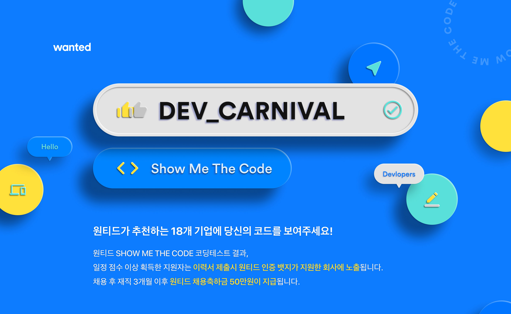
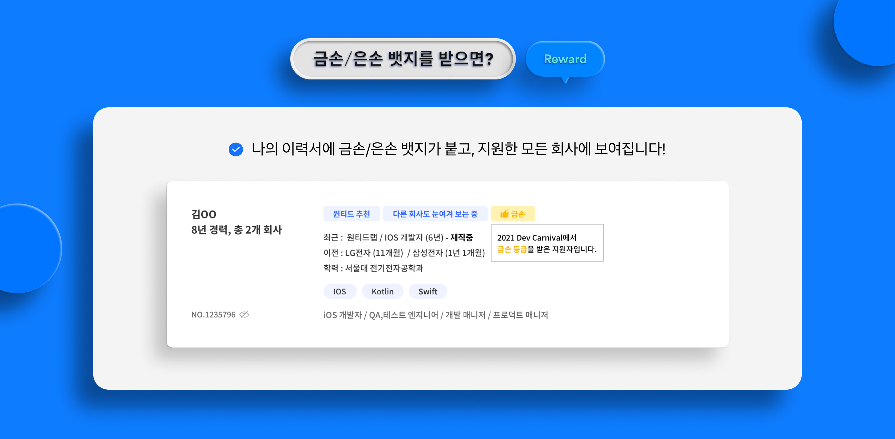
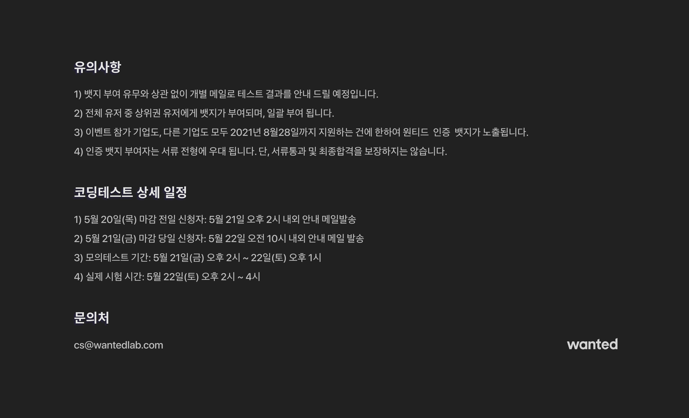

# 1. 원티드의 2021 DEV CARNIVAL

원티드에서 진행한 2021 DEV CARNIVAL을 참여했다.

---

# 2. REWARD

금손/은손 뱃지를 부여해 준다고 한다.

참여자 유의사항은 아래그림과 같았다.

---

# 3. 후기

시험은 그림에 나와있는대로 오후 2시부터 4시까지 2시간 진행됐다.

4문제가 출제되었고 문제의 난이도는 높은편이였다고 생각된다.

자세한 설명은 못하고 개인적으로 느낀점을 적었다.

(이 글이 문제가 될시 예고없이 삭제가 될 수 있다.)

## 3.1 1번문제

1번 문제는 간단한 구현문제 였다.

우선순위큐를 사용하면 금방 끝날 문제였는데 내가 C++ STL로 우선순위큐 사용하는 연습을 못해서 한시간 가까이 걸린것 같다 ㅠㅠ...(거의 직접구현 한듯...)

다른사람들은 오분 십분안에 끝낼 문제였다며...(오열...)

## 3.2 2번문제

BFS 혹은 DFS를 사용하는 탈출문제였다(미로찾기 같은?)

두개의 물체를 동시에 옮겨야해서 어려웠다.

구현은 다 했는데 뭔가 예외처리를 덜했는지 온전히 맞추지 못했다.

결국 시간제한으로 시험이 종료되었다.

## 3.3 3번문제

dp. 시간부족으로 손도 안대고 넘어갔다.(지금기억하려니 기억이 안난다.)

## 3.4 4번문제

그래프 길찾는 문제였다.(다익스트라) 길 방향이 움직일때마다 바뀌는 특성이 있어 풀다 틀린것 같다. 

전에 비슷한 문제를 2021 스타트업 코딩 페스티벌에서 틀렸었는데 다시한번 찾아봐야겠다.

## 3.5 풀이 결론

부분점수가 있다면 1 + 0.5 + 0.5 개 푼거같은데 은손뱃지를 받았다.

---

# 4. 유의사항을 보며

은손뱃지를 받아서 좋아해야할지 잘 모르겠다. 

시험 직후 개발자 오픈카톡방에서 하는 얘기에서 3솔도 많은것 같아 당황했다.

유의사항에 뱃지의 가산점으로 받아들이는건 회사 재량이라고도 써있기 때문에 결국 다른것도 잘해야한다.

스타트업 코딩 페스티벌에서도 본선 진출자에게도 결국 필기전형을 다시본 회사들도 많았기때문에 그냥 이력서 한줄 추가됐다고 생각하는게 맘 편할수도 있을 것 같다.

---

# 5. 이메일 인증

[인스타그램](https://www.instagram.com/p/CPaF5UpMj1y/?utm_source=ig_web_copy_link) (https://www.instagram.com/p/CPaF5UpMj1y/?utm_source=ig_web_copy_link)
